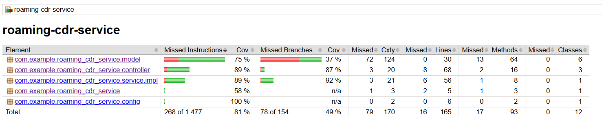
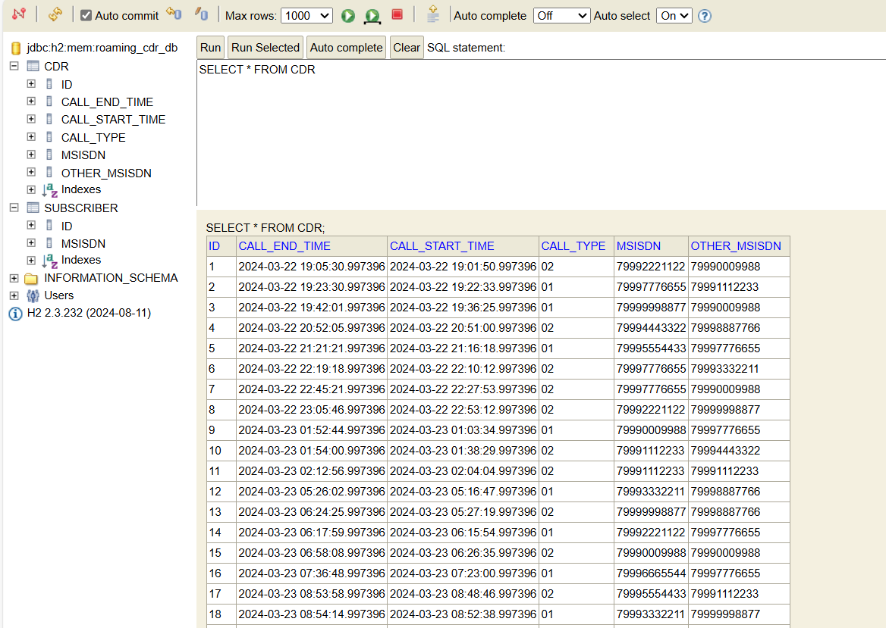
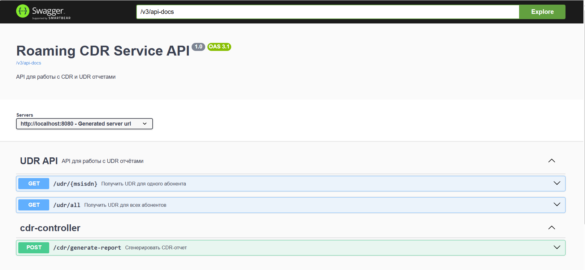
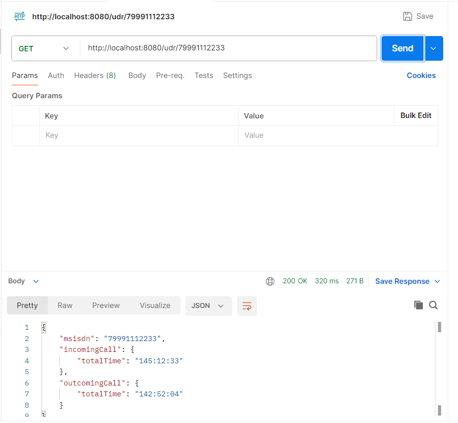
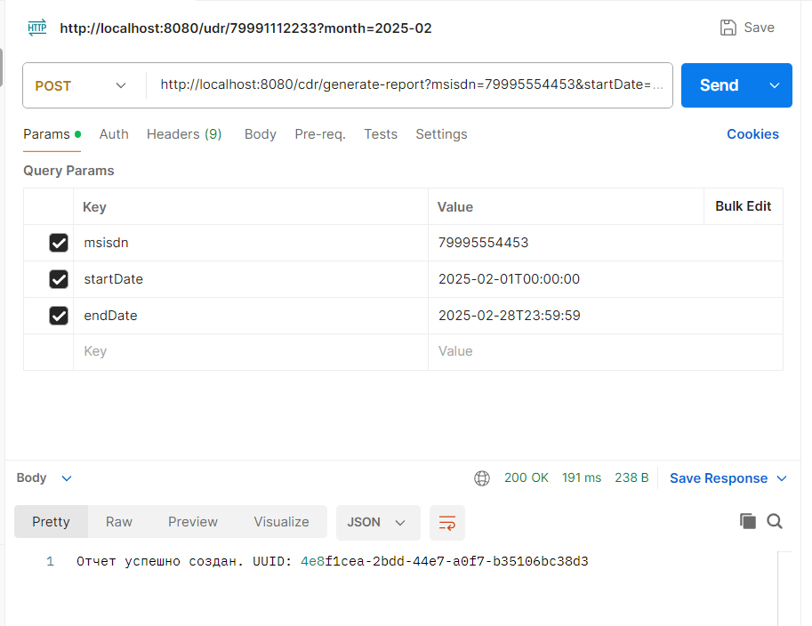
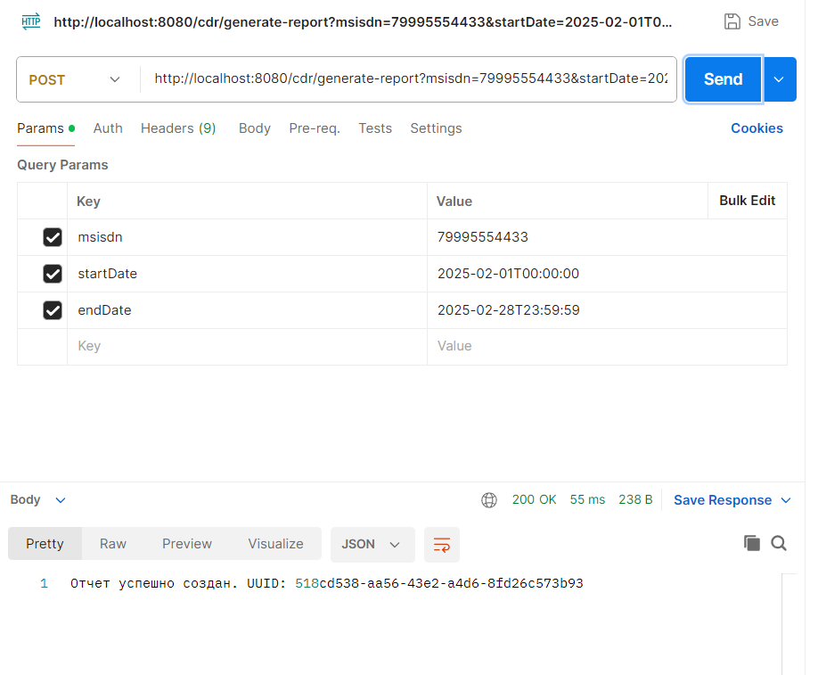
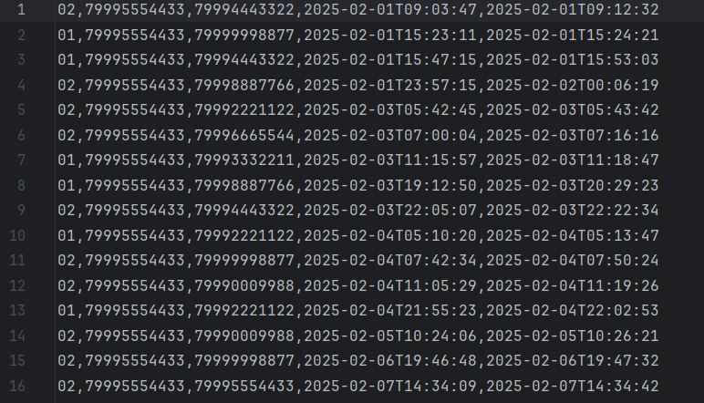

## Roaming CDR Service
Микросервис для генерации CDR записей и формирования UDR отчетов.

### Описание задания
Микросервис эмулирует работу коммутатора, генерируя CDR записи о звонках абонентов. На основе этих данных формируются UDR отчеты, которые используются для выставления счетов.

#### Основные функции
1. Генерация CDR записей за год.

2. Формирование UDR отчетов по абонентам.

3. Генерация CDR-отчетов в формате CSV.

### Технологии
- Язык: Java 17.
- Фреймворк: Spring Boot.
- База данных: H2 (встроенная).
- Библиотеки:
	- Spring Data JPA (для работы с БД).
	- Lombok (для упрощения кода).
	- Spring Web (для REST API).
	
### Запуск приложения
#### Требования
- Установленный JDK 17.
- Maven (для сборки проекта).

#### Шаги для запуска
1. Клонируйте репозиторий и соберите проект:

`git clone https://github.com/your-repository/roaming-cdr-service.git
cd roaming-cdr-service`
`mvn clean install`

ИЛИ 

Скачайте последний релиз, который находится в `releases/roaming-cdr-service-0.0.1-SNAPSHOT.jar`

ИЛИ

Скачайте последний релиз по ссылке https://github.com/OlgaRhythm/roaming-cdr-service/releases/tag/v1.0.0

2. Запустите приложение:

`java -jar target/roaming-cdr-service-0.0.1-SNAPSHOT.jar`

3. Приложение будет доступно по адресу: http://localhost:8080.

#### Эндпоинты (Swagger)

http://localhost:8080/swagger-ui.html

### Описание технического решения

Документация Javadoc: `mvn javadoc:javadoc`
 Документация будет доступна в папке `target/reports/apidocs`

После выполнения тестов отчёт о покрытии будет доступен в папке `target/site/jacoco/index.html`.

Покрытие тестами:

#### ER-диаграмма базы данных

ER-диаграмма базы данных включает в себя следующие таблицы:

- **Таблица `subscriber`**:
  - **Поля**:
    - `id` (Long): Уникальный идентификатор абонента.
    - `msisdn` (String): Номер абонента (MSISDN).
  - **Назначение**: Хранит информацию об абонентах, что позволяет эффективно управлять данными и их взаимодействиями.

- **Таблица `CDR`**:
  - **Поля**:
    - `id` (Long): Уникальный идентификатор записи.
    - `subscriberId` (Long): Идентификатор абонента, связанный с записью.
    - `callStartTime` (LocalDateTime): Время начала звонка.
    - `callEndTime` (LocalDateTime): Время окончания звонка.
    - `callDuration` (Duration): Длительность звонка.
  - **Назначение**: Хранит записи о звонках, что позволяет анализировать использование услуг абонентами.

**H2 Database** используется как встроенная база данных для тестирования и разработки. Она легковесная и быстрая, что делает её идеальной для таких целей. Поддерживает режимы работы в памяти и на диске, что обеспечивает гибкость в использовании.

Чтобы посмотреть базу данных, используйте H2 консоль:

- **URL**: [http://localhost:8080/h2-console](http://localhost:8080/h2-console)
- **Логин**: `ps`
- **Пароль**: `password`

#### Генератор CDR-записей

Генератор CDR-записей создаёт записи о звонках абонентов на протяжении года. В таблицу `subscriber` добавляются 10 абонентов. Звонки моделируются по **экспоненциальному закону распределения**, где средний интервал между звонками составляет 1 час, а средняя длительность звонка — 10 минут. Учитывается, что абоненты могут разговаривать только по одной линии одновременно.

#### REST API для работы с UDR

Эндпоинты документированы с помощью Swagger и доступны по адресу: http://localhost:8080/swagger-ui.html

REST API предоставляет доступ к UDR записям через следующие эндпоинты:

- **Получение UDR для одного абонента**:
  - **Метод**: `GET`
  - **URL**: `/udr/{msisdn}`
  - **Описание**: Возвращает UDR для указанного абонента за указанный месяц или за весь период (если месяц не передан — за последний год).
  - **Параметры**:
    - `msisdn` (PathVariable): Номер абонента.
    - `month` (RequestParam, необязательный): Месяц в формате "yyyy-MM".
  - **Коды ответов**:
    - `200`: Успешный запрос.
    - `400`: Неверный формат месяца.
    - `404`: Для абонента не найдены записи за указанный период.
  
  Пример результата выполнения запроса (через Postman):
  

- **Получение UDR для всех абонентов**:
  - **Метод**: `GET`
  - **URL**: `/udr/all`
  - **Описание**: Возвращает UDR для всех абонентов за указанный месяц.
  - **Параметры**:
    - `month` (RequestParam): Месяц в формате "yyyy-MM".
  - **Коды ответов**:
    - `200`: Успешный запрос.
    - `400`: Неверный формат месяца.

  Пример результата выполнения запроса (через Postman):
  

#### Генерация CDR-отчёта

**Формат отчёта**:
CDR-отчёт генерируется в формате CSV и содержит следующие поля:
- `id`: Уникальный идентификатор записи.
- `subscriberId`: Идентификатор абонента, связанный с записью.
- `callStartTime`: Время начала звонка.
- `callEndTime`: Время окончания звонка.
- `callDuration`: Длительность звонка.

**Эндпоинты для генерации CDR-отчёта**:
- **Генерация CDR-отчёта для одного абонента**:
  - **Метод**: `POST`
  - **URL**: `/cdr/generate-report`
  - **Описание**: Генерирует CDR-отчёт для указанного абонента за заданный период времени. Отчёт сохраняется в формате CSV в директорию `/reports`.
  - **Параметры**:
    - `msisdn` (RequestParam): Номер абонента.
    - `startDate` (RequestParam): Начальная дата периода в формате `yyyy-MM-dd'T'HH:mm:ss`.
    - `endDate` (RequestParam): Конечная дата периода в формате `yyyy-MM-dd'T'HH:mm:ss`.
  - **Коды ответов**:
    - `200`: Отчёт успешно создан.
    - `400`: Неверные параметры запроса.
    - `404`: Данные для абонента не найдены.
    - `500`: Ошибка при создании отчёта.

  Пример результата выполнения запроса (через Postman):
  

  Пример CDR-отчёта:
  

### Обоснование использования сторонних библиотек

- **Lombok**: 
  - **Назначение**: Lombok используется для автоматической генерации шаблонного кода, такого как геттеры, сеттеры, конструкторы, методы `equals`, `hashCode` и `toString`.
  - **Преимущества**: 
    - Уменьшает количество шаблонного кода, что делает код более чистым и поддерживаемым.
    - Повышает производительность разработки, позволяя разработчикам сосредоточиться на бизнес-логике.
    - Обеспечивает аннотации для упрощения работы с JavaBeans и паттернами проектирования.

- **H2 Database**:
  - **Назначение**: H2 — это встроенная реляционная база данных, используемая для тестирования и разработки.
  - **Преимущества**:
    - Легковесная и быстрая, что делает её идеальной для разработки и тестирования.
    - Поддерживает режимы работы в памяти и на диске, что обеспечивает гибкость в использовании.
    - Совместима с JDBC API, что упрощает интеграцию с Java-приложениями.

- **Springdoc OpenAPI**:
  - **Назначение**: Springdoc используется для генерации документации для RESTful API.
  - **Преимущества**:
    - Обеспечивает интерактивную документацию API, что упрощает тестирование и интеграцию.
    - Автоматически генерирует документацию на основе аннотаций в коде, что снижает вероятность ошибок в документации.
    - Поддерживает множество языков и фреймворков, что делает его универсальным инструментом для документирования API.

- **Apache Commons CSV**:
  - **Назначение**: Библиотека для работы с CSV файлами.
  - **Преимущества**:
    - Простота использования и интеграции.
    - Поддержка различных форматов CSV, что делает её гибкой для различных сценариев использования.

- **JUnit и Mockito** (для тестирования):
  - **JUnit**: Фреймворк для модульного тестирования, который позволяет писать и выполнять тесты для Java-приложений.
  - **Mockito**: Библиотека для создания mock-объектов в тестах, что упрощает тестирование взаимодействий между компонентами.

Эти библиотеки выбраны для повышения производительности разработки и обеспечения надежности и масштабируемости приложения. 